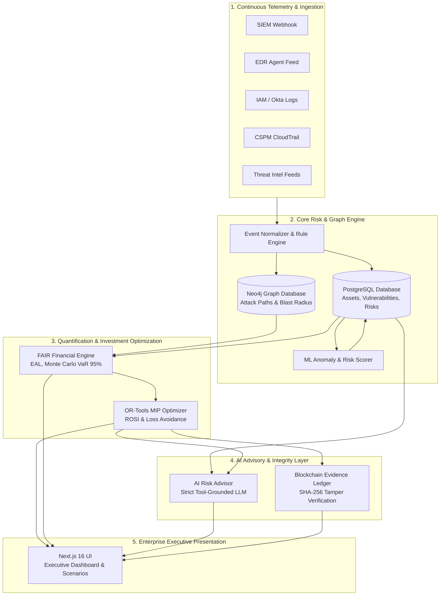

# CyberNexus: Final Architecture Specification
**SIH 2026 Problem Statement 26105**  
*AI-Powered Continuous Cyber Risk Quantification and Investment Optimization Platform*

---

## 1. Executive Summary & Architectural Vision

**CyberNexus** bridges the critical divide between technical cybersecurity operations and executive financial risk management. Traditional security tools (SIEM, EDR, CSPM) produce thousands of isolated alerts without quantifying business impact. CyberNexus continuously translates real-time technical signals into **graph-based attack paths**, calculates **Expected Annual Loss (EAL)** and **Value at Risk (VaR)** via Monte Carlo simulations, and uses **Mixed Integer Programming (OR-Tools)** to prescribe the mathematically optimal security investments for any given budget constraint. Every strategic decision is anchored in a **cryptographic blockchain evidence ledger** for non-repudiation and auditability.



---

## 2. Core Subsystems & Technical Details

### 2.1. Telemetry Ingestion & Normalization
- **Purpose**: Ingest continuous telemetry events from disparate enterprise tools (Splunk, Sentinel, CrowdStrike, Okta, AWS CloudTrail).
- **Security**: HMAC-SHA256 signature verification on incoming webhooks (`X-CyberNexus-Signature`).
- **Processing**: Normalize raw vendor payloads into a unified `TelemetryEvent` schema. Dynamically adjust asset exposure, vulnerability exploit status, and threat likelihood.

### 2.2. Graph & Attack Path Engine (Neo4j)
- **Nodes**: `Asset`, `Vulnerability`, `Threat`, `Identity`, `BusinessService`, `Control`.
- **Relationships**: `CONNECTS_TO`, `HOSTS`, `AFFECTS`, `TARGETS`, `CAN_ACCESS`, `PROTECTS`, `DEPENDS_ON`.
- **Attack Graph Pathfinding**: Multi-hop traverse from exposed entrypoints (`Internet`, `VPN Gateway`) through compromised credentials to crown jewels (`Customer Database`, `Payment Gateway`).
- **Graceful Degradation**: If Neo4j is offline or unreachable, graph synchronization operations gracefully fall back to in-memory path approximations, allowing core risk calculation and financial optimization to proceed uninterrupted.

### 2.3. Quantitative Financial Risk Engine (FAIR Methodology)
- **Expected Annual Loss (EAL)**:
  $$\text{EAL} = \text{Loss Event Frequency (LEF)} \times \text{Loss Magnitude (LM)}$$
- **Monte Carlo Simulation**:
  - 10,000 deterministic trial iterations using parameterized log-normal loss distributions.
  - Generates 95th percentile Value at Risk (VaR 95%), Expected Shortfall, and full cumulative density functions (CDF).
  - Seeded random generators guarantee deterministic reproducibility during executive board presentations and SIH demos.

### 2.4. Security Investment Optimizer (Google OR-Tools)
- **Formulation**: 0-1 Multi-Dimensional Knapsack Problem solved via Mixed Integer Linear Programming (CBC / SCIP solver).
- **Objective Functions**:
  - `MAX_RISK_REDUCTION`: Maximize aggregate points of enterprise risk reduction.
  - `MAX_LOSS_AVOIDED`: Maximize monetary loss avoided in INR (₹).
  - `MAX_ROSI`: Maximize Return on Security Investment.
  - `BALANCED`: Multi-objective Pareto frontier weighting financial and threat reduction.
- **Constraints**:
  - Hard budget ceiling ($\sum c_i x_i \le B$).
  - Implementation capacity and maximum concurrent projects.
  - Dependency prerequisites ($x_j \le x_i$ for prerequisites).
  - Mutual exclusivity ($\sum_{k \in S} x_k \le 1$).
- **Deterministic Fallback**: If OR-Tools native solver libraries are unavailable, a high-performance greedy heuristic optimizer automatically calculates the Pareto-optimal investment set.

### 2.5. AI Risk Advisor (Grounding & Guardrails)
- **Architecture**: Retrieval-Augmented Generation (RAG) with strict tool-calling.
- **Tools**:
  - `query_organization_metrics`
  - `calculate_financial_risk`
  - `optimize_investments`
  - `analyze_attack_path`
  - `verify_blockchain_evidence`
- **Security Guardrails**:
  - Zero access to database credentials, shell commands, or raw SQL/Cypher execution.
  - Multi-tenant tenant ID pinning: Advisor queries are strictly forced to the authenticated user's `organization_id`.
  - Prompt injection shielding: Refuses instructions attempting to override system behavior, reveal internal prompts, or access other tenants.
  - Offline Fallback: If external LLM APIs (OpenAI) are disabled or unconfigured, a deterministic Rule-Based Expert Advisor answers financial, risk, and investment queries with 100% mathematical consistency.

### 2.6. Blockchain Evidence & Audit Ledger
- **Role**: Non-repudiation and auditability layer for strategic security investment decisions and executive risk sign-offs.
- **Mechanism**:
  - Off-chain storage of detailed investment portfolios and risk snapshots.
  - SHA-256 cryptographic digest calculation over canonicalized JSON payloads:
    $$\text{EvidenceHash} = \text{SHA256}(\text{org\_id} + \text{timestamp} + \text{payload\_json} + \text{prev\_hash})$$
  - In-memory / database tamper verification endpoint (`GET /api/v1/evidence/verify/{id}`) checking against real-time state.
  - Tamper detection test verifies that modifying a single bit in the historical decision payload flags an immediate verification failure.

### 2.7. Multi-Tenancy, Authentication & RBAC
- **Authentication**: JWT tokens signed with HMAC-SHA256, salted passwords hashed with Argon2id.
- **Multi-Tenancy**: Every database query, graph traversal, and AI advisory call filters explicitly by `current_user.organization_id`. The client-supplied `organization_id` header or body is never trusted.
- **5 Enterprise Roles**:
  1. `SYSTEM_ADMIN`: Global infrastructure and tenant lifecycle.
  2. `CISO`: Strategic budgets, risk thresholds, board reports, and investment authorization.
  3. `SECURITY_ANALYST`: Telemetry triage, vulnerability management, attack path inspection.
  4. `RISK_MANAGER`: Framework compliance, audit evidence, risk register review.
  5. `EXECUTIVE`: High-level financial exposure, ROSI dashboards, executive summaries (Read-only).

---

## 3. Communication & Network Architecture

```
[ Browser / Client ]
        │  HTTPS / WSS (Port 3000 / 443)
        ▼
[ Next.js 16 Reverse Proxy / Frontend ]
        │  REST API / Bearer JWT (Internal Network)
        ▼
[ FastAPI Application Server (Port 8000) ]
        ├─── PostgreSQL 16 (Port 5432) ──── [ Relational Data & Evidence ]
        ├─── Neo4j 5.15 (Port 7687) ──────── [ Attack Graph & Topology ]
        └─── OpenAI API (HTTPS / TLS 1.3) ── [ AI Advisor / Fallback Engine ]
```

---

## 4. Resilience & Graceful Degradation Matrix

| Component | Failure Mode | System Response | End-User Impact |
|:---|:---|:---|:---|
| **Neo4j** | Connection timeout or daemon down | Degraded status reported via `/health/ready`; fallback to tabular attack paths | Core risk calculation, EAL, and optimizer operate with 100% fidelity. |
| **OpenAI API** | Rate limit, quota exceeded, or offline | AI Advisor engages deterministic expert heuristic engine | Advisor answers remain mathematically grounded and consistent with current database state. |
| **OR-Tools** | Missing native binary | Greedy heuristic optimizer automatically takes over | Budget optimization completes in < 5ms with near-optimal solutions. |
| **Telemetry Webhook** | Invalid HMAC signature | Request immediately rejected with HTTP 401 Unauthorized | Protects against spoofed telemetry and adversarial risk manipulation. |
