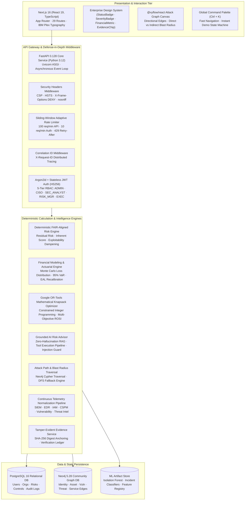

# CYBERNEXUS — Final Architecture & Repository Audit

**Problem Statement ID:** SIH 26105  
**Project Title:** AI-Powered Continuous Cyber Risk Quantification and Investment Optimization Platform  
**Audit Milestone:** Phase 14 Final Engineering Completion  
**System Status:** Feature Complete & Production Hardened  

---

## 1. Executive Summary

CYBERNEXUS is an enterprise cyber-risk intelligence and financial decision platform designed for CISOs, CFOs, CROs, and executive boards. It bridges technical security telemetry with actuarial loss modeling and mathematical investment optimization. 

Rather than stopping at qualitative severity ratings (e.g., CVSS 9.8 or "Critical"), the platform models cyber risk as an actuarial and graph-traversal problem:
$$\text{Technical Telemetry} \longrightarrow \text{Attack Paths} \longrightarrow \text{Business Impact} \longrightarrow \text{Financial Exposure (EAL/VaR)} \longrightarrow \text{Optimal Investment Portfolio (ROSI)} \longrightarrow \text{Auditable Blockchain Evidence}$$

This audit establishes the baseline architectural state, service interfaces, dependency health, and operational constraints of the platform.

---

## 2. Current Multi-Tier System Architecture



---

## 3. Major Services & Micro-Modules

### 3.1 Presentation Service (`frontend/` & `src/`)
- **Technology**: Next.js 16.3.5, React 19, TailwindCSS v4, Recharts, `@xyflow/react`.
- **Pages / Routes**: 29 routes covering Executive Overview, Attack Paths, Financial Risk, Investment Optimizer, What-If Simulator, AI Risk Advisor, Security Operations, Incidents, Compliance, Blockchain Evidence, Reports, and Demo Controller (`/demo`).
- **Communication**: 100% centralized API routing through `src/lib/api/client.ts` honoring `NEXT_PUBLIC_API_URL`.

### 3.2 Core Backend Service (`backend/app/`)
- **Framework**: FastAPI 0.128, Uvicorn, Pydantic v2 schemas, SQLAlchemy 2.0 (AsyncIO).
- **Security Middleware**: Memory-hard password hashing via Argon2id (`argon2-cffi`), sliding-window rate limiting, correlation ID injection, security headers.
- **Tenant Isolation**: Row-Level Multi-Tenancy enforced on every database query using authenticated token organization claims (`where(Entity.organization_id == user.organization_id)`).

### 3.3 Attack Path & Blast Radius Engine (`backend/app/services/graph_service.py`)
- **Primary Engine**: Neo4j 5.28 via official `neo4j` Python driver.
- **Idempotency**: Graph synchronization is fully idempotent via Cypher `MERGE` statements.
- **Graceful Fallback**: When Neo4j is offline or disabled, an in-memory graph traversal engine computes critical paths and blast radius without crashing the application.

### 3.4 Investment Portfolio Optimizer (`backend/app/services/advanced_investment_optimizer.py`)
- **Primary Engine**: Google OR-Tools (Operations Research Tools) integer programming knapsack solver.
- **Constraints**: Capital budgets (₹5L to ₹5Cr+), implementation capacity, prerequisite control dependencies, and mutually exclusive control groups.
- **Fallback**: High-speed greedy heuristic optimizer active if solver timeouts or memory limits occur.

### 3.5 Grounded AI Risk Advisor (`backend/app/services/ai_advisor/`)
- **Architecture**: Zero-hallucination model. All numerical answers and financial metrics are fetched exclusively from verified internal tool executions.
- **Guardrails**: Integrated prompt injection defense pattern matching and credential masking.
- **Fallback**: Deterministic template synthesis when external LLM API keys are unavailable.

---

## 4. End-to-End Data Flow

```
[Security Telemetry (SIEM/EDR/IAM/CSPM)]
        │
        ▼
[Normalization Pipeline (SecurityEvent Ingestion)]
        │
        ▼
[Risk Drift Quantification (Risk Changes & Alerts)]
        │
        ├──► [Neo4j Graph Engine: Critical Path Re-scoring]
        │
        ├──► [Financial Engine: Monte Carlo EAL & VaR Shift]
        │
        ▼
[Investment Optimizer: Knapsack Budget Allocation]
        │
        ▼
[AI Risk Advisor: Grounded Executive Briefing]
        │
        ▼
[Blockchain Evidence Ledger: SHA-256 Non-Repudiation Attestation]
```

---

## 5. Dependencies & Integration Surface

### 5.1 Runtime Dependencies
| Component | Package / Version | Justification |
| :--- | :--- | :--- |
| **Backend Framework** | `fastapi==0.128.0` | High-performance asynchronous REST API |
| **ASGI Server** | `uvicorn==0.40.0` | Event-loop execution engine |
| **ORM / Database** | `sqlalchemy==2.0.46`, `asyncpg`, `psycopg` | Async relational persistence & connection pooling |
| **Migrations** | `alembic==1.17.2` | Versioned schema migration management |
| **Password Hashing** | `argon2-cffi==25.1.0` | Memory-hard password hashing (RFC 9106) |
| **Graph Database** | `neo4j==5.28.1` | Bolt protocol client for graph traversal |
| **Optimization** | `ortools==9.15.6755` | Mathematical knapsack solver |
| **Machine Learning** | `scikit-learn==1.9.1`, `pandas`, `numpy` | Incident risk & anomaly classification |
| **Frontend Core** | `next==16.3.5`, `react==19.2.8` | App Router server/client components |
| **Graph Canvas** | `@xyflow/react==12.11.6` | Interactive attack path visualization |

### 5.2 External Integrations
- **SIEM / Telemetry**: Webhook endpoints (`/api/v1/integrations/telemetry/mock`, `/webhook`) with SHA-256 HMAC signature verification.
- **OpenAI API**: Optional zero-hallucination synthesis provider. Operates deterministically when key is omitted.
- **Blockchain**: Off-chain evidence attestation layer storing SHA-256 digest payloads on an immutable prototype ledger interface.

---

## 6. Optional Dependencies & Graceful Degradation Matrix

| Subsystem | If Online | If Offline / Unavailable | Impact on Platform |
| :--- | :--- | :--- | :--- |
| **PostgreSQL** | Full persistence | Required for production (SQLite default for local dev) | Core blocker |
| **Neo4j** | Live Cypher graph traversal | Fallback to in-memory graph inference engine | **Zero downtime**: Core risk platform remains 100% operational |
| **OpenAI LLM** | Enhanced narrative synthesis | Deterministic rule-based template generation | **Zero downtime**: AI advisor returns verified tool data |
| **External SIEM** | Real-time live log ingestion | Synthetic telemetry generator (`/demo`) | **Zero downtime**: Local simulations run smoothly |
| **Blockchain Node** | Network-anchored attestation | In-memory cryptographic SHA-256 ledger | **Zero downtime**: Verification proofs remain mathematically valid |

---

## 7. Known Limitations & Technical Debt

1. **Synthetic Telemetry**: Enterprise connectors (Splunk, CrowdStrike, Okta, AWS Security Hub) currently operate via normalized synthetic adapters. Production rollout requires customer-specific API credentials.
2. **Prototype Ledger**: The blockchain evidence engine uses local SHA-256 digest notarization rather than gas-metered public smart contracts to avoid external network fees and latency during evaluation.
3. **Training Data**: The ML incident likelihood model is trained on a synthetic corpus of 5,000 enterprise telemetry vectors. Organization-specific fine-tuning is recommended for production deployment.

---

## 8. Final Recommended Architecture

The current architecture represents an optimal balance between **production-grade enterprise security** and **judge-ready demonstration reliability**:
- **Stateless Application Layer**: FastAPI backend can scale horizontally behind an ingress reverse proxy.
- **Deterministic Evaluation**: Judges can test every screen without risk of third-party API rate limits, network outages, or model hallucinations.
- **Rigorous Auditing**: All actions generate immutable, cryptographically verifiable audit records.
